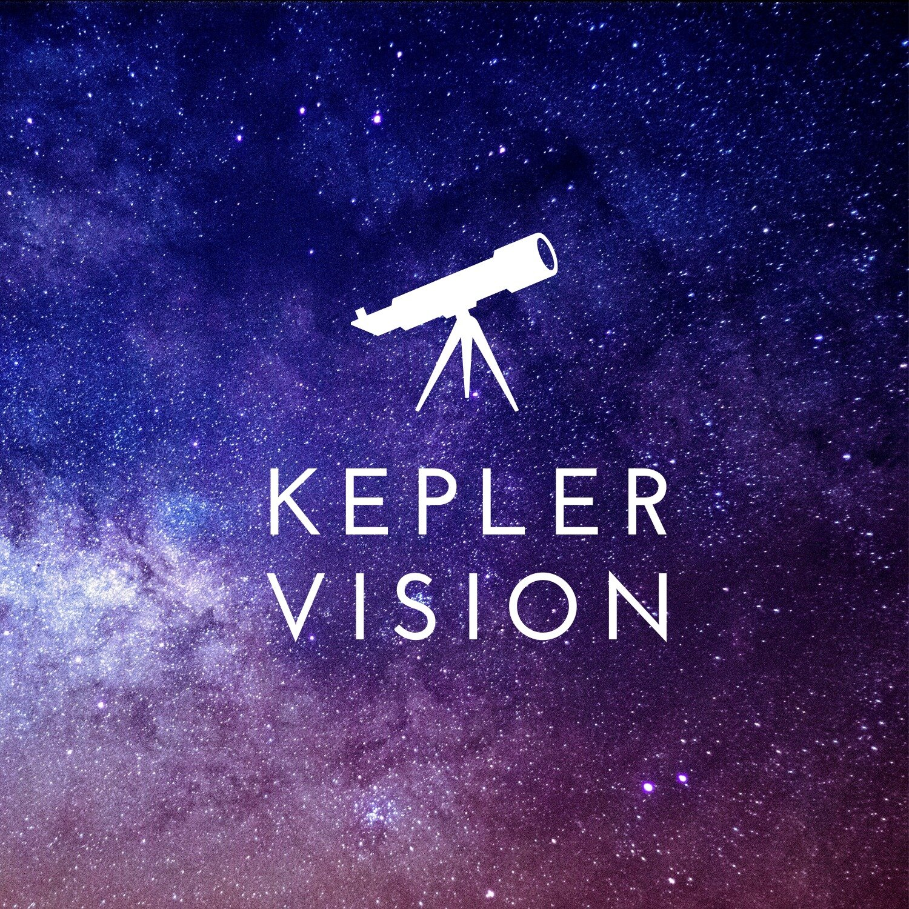

# Kepler Vision! (Final project )
 Our project puts its focus on the ability to use modern data science technologies and artificial networks to give a quick and accurate classification of exoplanets in our Milky Way galaxy. In addition, analysis of information from space.
 

# Goals : 

main goal: distributed deep artificial networks to achieve an accurate prediction of star classifications.

# Learning Process :

dataset that comes from NASA\JPL databases and choose from it the features that will help us in the classification process.

 ## Preprocessing & Processing Tools:
 * ONE-HOT-ENCONDING
 * Tensorflow 

 ## Authors
 
 

**Dolev Hindy**

**Arad Zekler**

**Naor Dahan**

